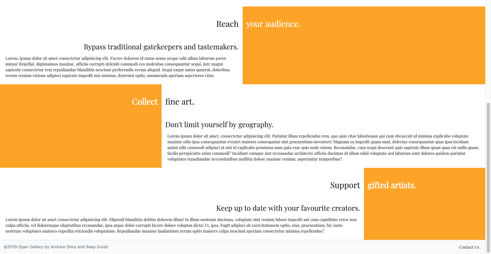

# Open Gallery
## The Online Art Gallery
Andrew Sims and Seep Gulati

[Our Application](http://open-gallery.herokuapp.com)

[Github Repository](https://github.com/andrewcameronsims/opengallery)

## Project Description

### Problem definition
An online marketplace to connect artists and art-lovers. Our platform gives artists the opportunity not only to sell their works but also to set-up patronage relationships with art-lovers who can choose to “follow” them and be the first to see new works as they go up for sale. The products are original “pieces”(either painting, drawings, or sculpture) -- basically things that you would find in a gallery which has pieces for sale.

### Site Map

### Functionality
- Open Gallery allows users to browse art pieces.
- Open Gallery allows user to interact with Open Gallery admin through Contact Us form in the footer.
- Open Gallery allows artists to sell their art pieces and also buy art pieces from other artists. 
- Open Gallery allows the signed-in users to buy art pieces.
- Open Gallery allows the signed-in users to follow their favourite artists.
- Open Gallery allows the signed-in users to contact the artists through a form.
- Open Gallery allows the signed-in users to contact the artists in-built contact form.

### Screenshots

### Outside inspiration

We were inspired by other two-marketplaces and particularly those dealing with
arts and crafts, such as [Etsy](https://www.etsy.com/) and 
[Bluethumb](https://bluethumb.com.au/).

### Technology Stack

Open Gallery is built using Ruby-on-Rails, with Ruby as the serverside language
and HTML and CSS for the front-end markup. We run a Postgresql instance as our database.
We also used some minimal javascript and jQuery for AJAX requests. The app is 
deployed on Heroku.

## Installation

1. Navigate to a location where you want to install the source and run `git clone https://github.com/andrewcameronsims/opengallery.git`

2. Reset the database using `rails run db:reset`

3. Run `rails server` to run the server in development mode.

## Design process

Despite making some concessions to responsive design, we concieved of our webapp as
a "desktop-first" experience. That has to do with the nature of our business problem.
If people are buying a piece of art, it is unlikely that they will be viewing the piece
on a small screen; they are more likely to want to see it in full resolution.

### Initial idea

### Final Idea

[Detailed Design Process](https://docs.google.com/document/d/1nvvriwgaqZyM2bJsPWC-SLGM1BwB4ZtRzdg3L8unjTE/edit)

### Colours

We have used Orange as our main colour through-out our application. Orange blends well with timeless Black and White combination.

Orange has been used for its association with ‘creativity’, ‘fascination’,‘stimulation’ and ‘contemporary’ feelings. As an online-visual art gallery for amateur artists standing out was important and orange with its high-visibility power helps in catching attention and highlighting the most important elements of our website design.

### Logo

We came-up with few renditions of logo and decided the simple option with 
‘Playfair font’ and brand colours.

### Wireframe sketches

### Workflow Diagram

### Wireframes

### ERDs

### Email for testing mailers

**Username**: testuserapp6@gmail.com

**Password**: StrongPassword1234!

## Timeline

### Week 1:

#### Monday

- ERD
- Trello
- Wireframes
- Design brief
- Sign off

#### Tuesday

- Make a list of required controllers/views/models
- Generate controllers (with actions and views), migrations, models, and mailers
- Pull skeleton design onto each laptop
- Add dependencies and config (add bootstrap, faker gem, devise, stripe, mailgun, amazon image hosting)
- Seeding
- Think about responsibilities/delegation

#### Wednesday

- Fix seeder script
- Draft Navbar
- Draft Footer
- Customize Devise
- Draft 'Home' pieces#Home
- Create Routes - Routes.rb
- Fill out methods for CONTROLLERS- Workshop, Piece

#### Thursday

- Draft 'Invoice' confirmation View
- Draft 'Invoice' confirmation View
- Draft 'Pieces#Show view
- Draft 'Pieces#New view

#### Friday

- Working on making app MVP ready

#### Sunday

- MVP done

### Week 2:

#### Monday & Tuesday

- Deployed MVP on Heroku
- Worked on a new model for Follower
Tuesday
- Follower functionality through JS
- Validations

#### Wednesday

- Bug fixes with deployment
- Validations

#### Thursday

- Bug fixes with deployment
- README.md
- Ensure Responsive design in mobile
- Complete wireframes and designs in Figma
- Workflow diagram

#### Friday

- Tweak READMe
- Make sure code is well commented
- Presentation
- Divide parts of the presentation
- Submission

### Team Communication Screenshots

- Slack

- Trello

### Version Control Screenshots

- Git

[Our Trello Board](https://trello.com/b/GJDgjVyc/ror-project)

## Short Answer Questions

### 1. What is the need (i.e., challenge) that you will be addressing in your project?

Many people desire to own an original piece of art that they can display in their home. 
In our project, we are providing an online venue for the purchase and sale of original
pieces of art.

### 2. Identify the problem you’re trying to solve by building this particular marketplace App? Why is it a problem that needs solving?

Even if the desire to purchase original artworks is widespread, there are artificial
barriers in place which prevent this. These barriers exist both on the side of purchase
and the side of sale. These partly have to do with the inefficient social institutions which
surround this market, and partly to do with geographical limitations. For example,
modish gallerists and other players may exclude outsiders who have a
legitimate niche in the market. Likewise, the geographical limitations of brick-and-mortar
galleries may limit buyers to those who can visit those locations.

### 3. Describe the project will you be conducting and how your App will address the needs.

Our application will lower traditional barriers to the purchase and sale of original
art, bypassing traditional gatekeepers and tastemakers such as gallerists, critics,
and curators. By using Open Gallery, artists will be able to strike out on their own
without having to come to terms with the baroque and difficult institutions of the
art-world, and the ease with which purchases can be made online will make owning 
original pieces of art an experience that is open to all. At the same time, this means 
that our platform ensures that a greater diversity of style is available on the market. 
We want there to be something for everyone.

### 4. Describe the network infrastructure the App may be based on.

We have deployed our app using the Heroku cloud service, which is a containerization
ecosystem. Heroku runs containers called *dynos* which package together an application
and all its dependencies. Dynos don't themselves have a permanent filesystem for
storage and rely on a database for persisting data. The end user is able to use our
app through HTTP request-and-response cycles between the browser and the Heroku dynos.

### 5. Identify and describe the software to be used in your App.

Our application utilizes Ruby version '2.5.1'and following softwares: 

* Ruby on Rails provided us with a structure for our Ruby code,allowing us to launch application faster. 
* Visual Studio Code helped us in writing our source-code and supported debugging. 
* Ruby gems as a packet manager gave us access to various libraries and programs and easily manage the installation process.

#### Gem dependencies:

gem 'rails', '~> 5.2.3'

gem 'pg', '>= 0.18', '< 2.0' 

gem 'puma', '~> 3.11'  

gem 'sass-rails', '~> 5.0'

gem 'devise', '~> 4.6' 

gem 'cancancan', '~> 3.0'

gem 'faker', '~> 1.9'

gem 'aws-sdk-s3', '~> 1.36'

gem 'bootstrap', '~> 4.3'

gem 'jquery-rails', '~> 4.3'

gem 'stripe', '~> 4.16'

gem 'pry', '~> 0.12.2'

gem 'dotenv-rails', groups: %i[development test]

gem 'jbuilder', '~> 2.5'

gem 'coffee-rails', '~> 4.2'

gem 'turbolinks', '~> 5'

gem 'bootsnap', '>= 1.1.0'

gem 'tzinfo-data', platforms: %i[mingw mswin x64_mingw jruby]

Our application is action-packed with authentication (Devise), authorization (CanCanCan), image uploading capablity through *third-party services (AWS), payment system (Stripe), transactional emails (Mailgun), filtering capablity images (API) and deployed on Heroku.

* Third-party applications are mentioned in detail on Answer 10.

### 6. Identify the database to be used in your App and provide a justification for your choice.

We are using a Postgresql relational database. The advantages of relational databases
are their reliabity, simplicity, and efficiency in processing queries. Furthermore,
relational databases are compatible with a wide range of different softwares for the
other abstraction layers (in this case, Rails).

### 7. Identify and describe the production database setup (i.e. postgres instance).

Postgresql is an open source implementation of the relational database architecture.
This is the database setup that we have been using in our production as well as our
development environments. This ensures consistency across those contexts. The Ruby gem
that is required to use this system is installed as a dependency in our Bundle file and
Heroku takes care of most of the details during deployment. Most of our interaction 
with the database is done through ActiveRecord.  We have occasionally needed
to reset and reseed the database remotely and this can be done by running
`heroku pg:reset DATABASE` and `heroku run rails db:seed` at the terminal.
We chose to keep our database slim. We anticipated that a gratuitously complex database
schema would result in problems during development and instead
implemented our functionality through table relationships and client-side
technologies (i.e. encrypted cookies).

### 8. Describe the architecture of your App.

Our application follows the standard Model-View-Controller (MVC) architecture. This
conceptualises a piece of software in terms of three functional modules:

* The model contains the information and logic that is required to perform the
functions of the app. 
* The view determines the information that will be presented to the user, and the
manner in which this information will be presented.
* The controller mediates user requests for information to the model and then determines
how the view will be used in order to filter that information to the user. 
(E.g., by triggering one rather than another view)

### 9. Explain the different high-level components (abstractions) in your App.

Our application implements the high-level abstractions of MVC in terms of the
pre-existing Rails conventions. In Rails, this architecture is implemented by 
the ActiveRecord (allows us to interact with a database without writing SQL queries, 
and allowing us to treat the model as a Ruby object), ActionController (controller), 
and .erb templates (view). For example, we have included additional methods within 
our model which allow it to be sorted according to user preferences before being 
passed to the view. Rails contains many other abstraction layers over other services. 
For example, ActiveView form helpers allow us to produce forms for our models without
writing many lines of HTML, and our resourceful syntax allow us to produce the standard
RESTful routes in less lines of code. Finally, ActiveStorage serves as a helpful
abstraction layer over AWS S3 in our case and facilitates our usage of that service
in idiomatic Ruby.

### 10. Detail any third party services that your App will use.

Apart from the Ruby Gem depencies mentioned in question 5, our application uses:
* Mailgun - Provides the application with mailer functionlity. Buyers and Sellers recieve purchase invoices through emails.
* Stripe - Implements a payment system for our application by charging appropriate amount through credit card.
* Amazon web services - Provides on-demand cloud image storage services.
* Fontawesome - Provides icons for follower action.
* Bootstrap - Provides CSS support for styling.

### 11. Describe (in general terms) the data structure of marketplace apps that are similar to your own (e.g. eBay, Airbnb).

Our application is a type of application called a *two-sided marketplace*.
The role of a two-sided marketplace is to provide an online venue in which transactions
can take place between two kinds of users. In the case of Uber, for example, these
transactions take place between drivers and passengers. There are certain details about
the requirements of these applications that can be generally stated. First,
they need to take into account that there are two kinds of users on the application either
through two database tables or some other means. Secondly, they need to keep track of
purchases either themselves or by outsourcing this task to a third party like Stripe.
Finally, the items that are themselves transacted (e.g., rides, or art pieces, or stays
in a home) need to be kept track of through a database.

### 12. Discuss the database relations to be implemented.

When we started working on the app we had settled on only three tables in the database.

* **users**: Keeps track of users of the app. "Artist" and "Admin" flags keep track of the
authorisation and status of these users. We used the Devise gem to create this model and
take care of most of the implementation details. We also added a list of keywords in order
to prioritise which artworks would be shown to which users.
* **workshops**: Keeps track of users of the app who also sell artworks.  This table contains
all of the business information that is required in addition to standard user information
in cases where that user is playing a vendor role. 
* **pieces**: Keeps track of transacted artworks. Includes information to categorise the 
piece to prioritise showing them to users who have listed those categories in 
their interests.

On Monday morning we found ourselves with a MVP and a week of time, so we decided to
implement additional features. One of these was the ability of users to follow artists,
so that new and current pieces by that artist would appear at the top of the list of
pieces in their feed. That required us to create a join table to keep track of who was
following who.

* **followers**: A join table to keep track of many-to-many relationships between users and workshops.

### 13. Describe your project’s models in terms of the relationships (active record associations) they have with each other.

Given the slim database strategy we adopted, the relations between our tables
became important for playing the role that these missing tables would otherwise play.

* **a one-to-one relationship between workshops and users**: Since additional 
information is required for business purposes when a user takes up a vendor role,
and this information is stored in the workshop table, this relationship was required
in order to link business information with the appropriate user.

* **a many-to-one relationship between pieces and workshops**: One artist may have
many pieces on the site that she wishes to sell. This relationship keeps track of that
initial ownership between the piece and its artist.

* **a many-to-one relationship between users and pieces**: We needed to persist
information about purchases in the case of dispute and for audit purposes. However,
we do not have a dedicated table in our database for purchases. Instead, we had a
many-to-one relationship between users and pieces which keep track of the buyer of
a piece.

* **a many-to-many relationship between users and workshops**: This is a join table
which keeps track of the following relationship between users and workshops. Users may
follow many artists (workshops), and workshops may themselves have many users.

### 14. Provide your database schema design.

### 15. Provide User stories for your App.

User stories have been planned as per role, action and business goal/reasoning).

As a User (role), 
I want to browse all the pieces (action),
So that I can select and buy the piece I like (business-goal/reasoning).

As a User,
When I'm attempting to sign in, I should see a way to reset my password,
So that I can confirm my new password when resetting.

As a User,
I want a way to contact with artists,
So that I can order pieces after a conversation.

As a User,
I want an easy payment process,
So that I can be sure of my purchase.

As a User,
I should get a payment reciept,
So that I can easily track my finances.

As a User,
I want to follow artists,
So that I can see their newest pieces first and accordingly make a selection.

As an Artist,
I can even buy pieces from other artists,
So that I can have a my personal collection of antique pieces from the gallery.

As an Artist,
I can add my piece,
So that Users can buy it from the gallery.

As an Artist,
I can update my piece,
So that Users can buy final works from the gallery.

As an Artist,
I should get a payment reciept,
So that I can easily track to whom I need to send the product and keep a tab on my inventory.

### 16. Provide Wireframes for your App.

### 17. Describe the way tasks are allocated and tracked in your project.

- Slack

- Trello

- Git

### 18. Discuss how Agile methodology is being implemented in your project.

We adopted aspects of Agile methodology in our project. We performed daily
stand-ups with other groups. During these we would spend under a minute explaining
what we had just achieved, our work goals for the day, and what 
blockers were standing in the way of us achieving these goals.
We used the online Trello system to keep track of our workflow and to divide
the work between us according to TODO tasks, tasks in progress, and completed
tasks. Another agile method we adopted was pair programming. We did this on tasks
where it was particularly important for us to be on the same page (e.g., initial
configuration). Finally, we worked in iterations in the sense that we did not separate
types of goals serially (e.g., functionality then styling) in the traditional
waterfall style. Instead, we performed these tasks in parallel. That allowed us 
to have an MVP up and running as soon as possible.

### 19. Provide an overview and description of your Source control process.

We adopted a typical Git workflow, using git on our local machines and GitHub for
the remote copies of our repository. Whenever we wanted to add a new piece of
functionality or styling to the existing codebase, we would open a new branch with
an appropriate name and work within this. When we had completed the feature, we 
would push the branch to GitHub and make the PR, sometimes associated with further
explanation if we had been apart during the work or if our commits might not be
transparent in their purposes. Then the PR would be pulled up into the master
branch. Occasionally we could commit directly to the master branch when the changes
were straightforward (e.g., writing this README).

### 20. Provide an overview and description of your Testing process.

Despite good intentions, we neglected any kind of automated testing (e.g., Minitest)
from the beginning, limiting ourselves to manual testing through interaction with
the app in the browser. Feeling an acute awareness of our deadline, we told ourselves
that we would be able to implement the coded tests post-hoc, and that even if
this did not inform development that they might anyway catch bugs in regression.

That turned out to be a mistake, because there were obstacles in the way of post-hoc
testing that made any sort of automated testing infeasible within our timeframe.
For example, there were issues with database permissions that made the setup and
breakdown process fail when we tried to run `rails t`. There were also some problems
that remain obscure to us, but that had to do with our user_id foreign keys, the way
devise models users, and our default user fixtures. The lesson we've taken from this 
is to build in a testing framework from the ground floor so that these kinds of 
headaches don't occur later on and can be resolved immediately.

### 21. Discuss and analyse requirements related to information system security.

There are many such requirements, both in the development and production environments.
In the development environment, we need to be sure that sensitive data (such as API keys)
are not carelessly uploaded into publicly-accessible git repositories such as GitHub.
One way to prevent this is to keep that data in an `.env` file that is included in
our `.gitignore` and referenced in the code of the application. Another is to use the
built-in rails credentials functionality which encrypts that information using a master
key that is excluded from the git.

On the production side, we need to be sure that the information in our database can only
be accessed in the way that we want it to be accessed -- that is to say, by users who are
authenticated as genuine and authorised to see that particular data.

### 22. Discuss methods you will use to protect information and data.

We have implemented authentication in our application with the help of Devise, which is 
a third-party library for Rails. That creates for us a user object with registration and
session controllers which handle registration, logging in, and  all of the associated
authentication apparatus.

Authentication is partly handled by CanCan, which is another third-party library which sets
permissions on RESTful actions. However, we also built in our own authentication methods
by setting user_id checks on the edit and delete actions so that only users who actually
own pieces can update or destroy them.

In the one case where we saved information in the session, we used encrypted cookies to prevent client-side tampering.

### 23. Research what your legal obligations are in relation to handling user data.

Businesses in Australia who come into contact with user data have to make a decision
about whether or not they want to be GDPR compliant. GDPR (General Data Protection
Regulation) is a body of law that applies in European countries and to European 
citizens, and Australian businesses who want to access the European market therefore have
to comply with that legislation.

The GDPR sets out the rights of individuals with respect to their personal data. Amongst
the legal obligations of GDPR-compliant businesses are that they are transparent with
their customers with respect to what data they are collecting and for what purpose, that
they do not collect any more data that these purposes imply, that they erase that 
data upon the request of the user, and that they keep this data accurate and up-to-date.
They should also take reasonable steps to keep this data secure against unauthorised access.
